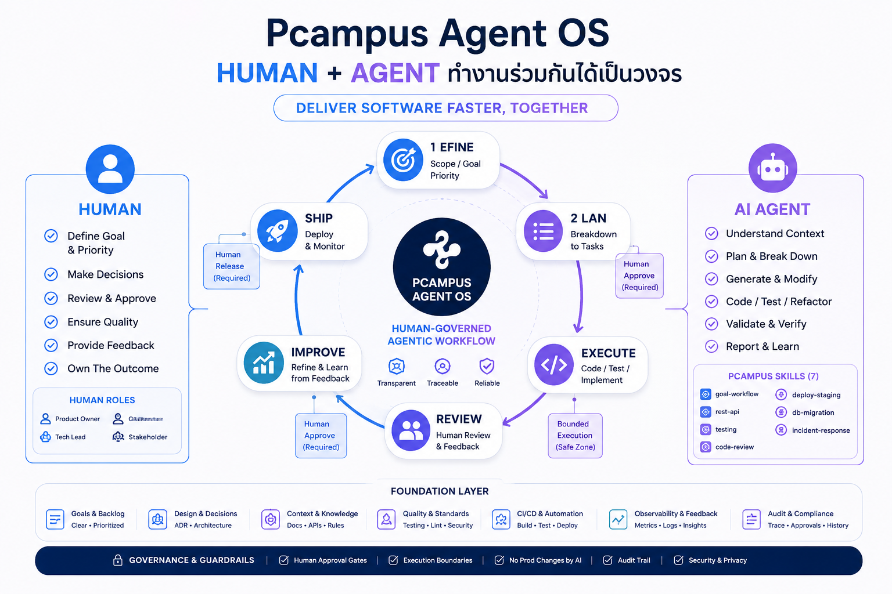

# Pcampus Agent OS

**Pcampus Studio** — goal-driven Human + Agent development with **governance layer** for human-approved AI delivery.

```text
Pcampus Agent OS = Context + Skill + Goal + Governance + Approval + Audit
```

Copy this **Agent OS** into a new project (`scripts/bootstrap.sh`) or **upgrade** an existing one (`scripts/upgrade-os.sh`). **Process, skills, and rules ship complete**; fill product docs and `code/` per project.

## Human + Agent cycle



Framework map: [docs/03-architecture/design-spec.md](docs/03-architecture/design-spec.md) · Details: [docs/06-workflows/team-workflow.md](docs/06-workflows/team-workflow.md)

---

## Team workflow (start here)

1. **[docs/06-workflows/team-workflow.md](docs/06-workflows/team-workflow.md)** — 6-phase cycle, Mermaid diagrams, prompt cheat sheet  
2. **[AGENTS.md](AGENTS.md)** — AI entry point (agents read first every session)  
3. **[docs/04-agents/skills-library.md](docs/04-agents/skills-library.md)** — 7 versioned Pcampus skills

---

## Quick start — new project

### 0. Get Agent OS

```bash
git clone git@github.com:Pcampus-Studio/Pcampus-Agent-OS.git pcampus-agent-os
cd pcampus-agent-os
```

### 1. Bootstrap

**Linux / macOS / Git Bash (requires `rsync`):**

```bash
./scripts/bootstrap.sh /path/to/my-new-project "My Project Name"
cd /path/to/my-new-project
```

**Windows (PowerShell — no rsync):**

```powershell
.\scripts\bootstrap.ps1 C:\path\to\my-new-project "My Project Name"
cd C:\path\to\my-new-project
```

### 2. Fill product docs (Planner)

| File | Purpose |
|------|---------|
| [docs/02-product/project-brief.md](docs/02-product/project-brief.md) | Canonical product spec |
| [docs/02-product/mvp-scope.md](docs/02-product/mvp-scope.md) | In / out of MVP |
| [docs/03-architecture/overview.md](docs/03-architecture/overview.md) | Stack & system context |
| [docs/07-backlog/goals.md](docs/07-backlog/goals.md) | G-001, G-002, … |
| [docs/00-project-snapshot.md](docs/00-project-snapshot.md) | TL;DR for agents |
| [docs/05-decisions/](docs/05-decisions/) | Replace example ADR with real decisions |

**Keep unchanged:** `design-spec.md`, `pcampus-*` skills, process workflows.

### 3. Customize agent entry & CI

| File | Customize |
|------|-----------|
| [AGENTS.md](AGENTS.md) | Mission, `{TEST_COMMANDS}` |
| [.cursor/rules/{stack}.mdc](.cursor/rules/) | Copy from `stack-*.example.mdc` |
| [.github/ci-config.yml](.github/ci-config.example.yml) | Copy example → set test/lint at G-001 |

Governance rules (`governance.mdc`, `security.mdc`) and GitHub workflows ship complete — do not remove.

Enable **branch protection** after first push: [docs/06-workflows/github-governance.md](docs/06-workflows/github-governance.md)

### 4. Start first dev round

Set **G-001** to `ready`, then in Cursor:

```
อ่าน AGENTS.md แล้วทำ G-001 ตาม goals.md
ใช้ pcampus-testing และ pcampus-code-review ก่อนปิด goal
```

---

## Upgrade existing project

When **Pcampus Agent OS** gets a new version:

```bash
# From latest Agent OS clone — preview first
./scripts/upgrade-os.sh /path/to/existing-app --dry-run

# Apply framework sync
./scripts/upgrade-os.sh /path/to/existing-app --yes
```

Then **merge manually**: `AGENTS.md`, `goals.md`, `00-project-snapshot.md` — see [docs/06-workflows/upgrade-agent-os.md](docs/06-workflows/upgrade-agent-os.md).

**Do not** run `bootstrap.sh` on an existing repo — it overwrites product files.

---

```text
DEFINE → PLAN → EXECUTE → REVIEW → IMPROVE → SHIP
```

| Phase | Skill (agent) |
|-------|---------------|
| PLAN / any goal | `pcampus-goal-workflow` |
| API work | `pcampus-rest-api` |
| Tests | `pcampus-testing` |
| Before done | `pcampus-code-review` |
| Staging | `pcampus-deploy-staging` |
| Schema | `pcampus-db-migration` |
| Incidents | `pcampus-incident-response` |

---

## How to assign work (cheat sheet)

| ✅ Good | ❌ Avoid |
|---------|----------|
| ทำ G-003 ตาม goals.md | ทำแอปให้เสร็จ |
| review G-003 ตาม code-review skill | merge โดยไม่ review |
| ต่อ goal ready ถัดไป | refactor ทั้ง repo |
| commit G-003 | commit ทุกอย่างที่แก้ |

**Humans define scope — AI implements.**

---

## Folder map

```text
AGENTS.md                      ← AI entry point
.cursor/
  rules/                       ← core, governance, security, guidelines, stack
  skills/pcampus-*/            ← 7 standard skills (versioned)
docs/
  00-index.md                  ← doc map
  00-project-snapshot.md       ← agent reload TL;DR
  01-vision.md                 ← optional principles
  02-product/                  ← brief, scope, acceptance contracts
  03-architecture/
    design-spec.md             ← framework map (do not remove)
    overview.md, folder-structure.md
    api/                       ← API contracts (fill per goal)
    data/                      ← business rules (fill per goal)
  04-agents/                   ← dev roles, skills-library
  05-decisions/                ← ADR template + example
  06-workflows/                ← dev loop, DoD, team-workflow
  07-backlog/                  ← goals, changelog-goals, audit changelog
  assets/                      ← diagrams (human-agent-cycle.png)
.github/
  workflows/                   ← governance + CI
  pull_request_template.md
  ci-config.example.yml
docker/                        ← optional
code/                          ← application source (fill at G-001)
scripts/bootstrap.sh           ← new projects
scripts/upgrade-os.sh          ← existing projects (framework only)
```

---

## Project-specific extensions

Add only when a convention is unique to one product:

```text
.cursor/skills/{project}-api/SKILL.md
.cursor/rules/{stack}.mdc
```

Register in [docs/04-agents/skills-library.md](docs/04-agents/skills-library.md) and [AGENTS.md](AGENTS.md).

---

Maintained by **Pcampus Studio**.  
GitHub: [Pcampus-Studio/Pcampus-Agent-OS](https://github.com/Pcampus-Studio/Pcampus-Agent-OS)
