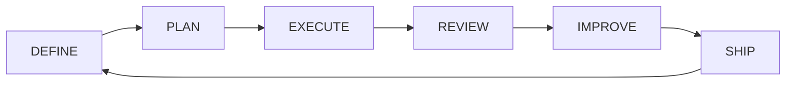

# Design spec — Pcampus Human + Agent framework

> **Pcampus Agent OS — canonical framework** for every Pcampus Studio project.  
> Maps the [Human + Agent cycle](../assets/human-agent-cycle.png) to this repository structure.

Copy this Agent OS via `scripts/bootstrap.sh`; process docs and skills stay **unchanged** across projects. Product content (`brief`, `goals`, `code/`) is filled per project.

---

## 1. Collaboration cycle (6 phases)



| Phase | Human | AI agent | Framework location | Skill |
|-------|-------|----------|-------------------|-------|
| **DEFINE** | Scope / goal / priority | Understand context | `docs/02-product/`, `docs/07-backlog/goals.md` | — |
| **PLAN** | Make decision | Plan & execute | Goal block, `docs/05-decisions/` | `pcampus-goal-workflow` |
| **EXECUTE** | — | Generate & modify | `code/`, `.cursor/rules/` | task-specific `pcampus-*` |
| **REVIEW** | Review & improve | Report & learn | Acceptance criteria, human diff | `pcampus-code-review` |
| **IMPROVE** | Ensure quality | Test & validate | `definition-of-done.md` | `pcampus-testing` |
| **SHIP** | Own the outcome | Prepare deploy, report | CI, staging env | `pcampus-deploy-staging` |

**Human onboarding:** [team-workflow.md](../06-workflows/team-workflow.md)  
**Agent entry:** [AGENTS.md](../../AGENTS.md)  
**Skill catalog:** [skills-library.md](../04-agents/skills-library.md)

---

## 2. Single source of truth — folder mapping

| Infographic | Purpose | Framework path | Shipped |
|-------------|---------|---------------|---------|
| `/docs` | Project overview | `docs/00-index.md`, `docs/01-vision.md`, `README.md` | ✅ |
| `/requirements` | PRD & requirements | `docs/02-product/` | ✅ |
| `/api` | API contracts | `docs/03-architecture/api/` | ✅ |
| `/architecture` | System design | `docs/03-architecture/` | ✅ |
| `/guidelines` | Coding standards | `.cursor/rules/`, `pcampus-*` skills | ✅ |
| `/data` | Business rules | `docs/03-architecture/data/` | ✅ |
| `/assets` | References, diagrams | `docs/assets/` | ✅ |

**Cursor agent layers (required):**

| Layer | Path |
|-------|------|
| Entry point | `AGENTS.md` |
| Always-on rules | `.cursor/rules/` |
| Playbooks | `.cursor/skills/pcampus-*/` |
| Application | `code/` |

---

## 3. Four pillars — shipped in Agent OS

### Pillar 1: Single source of truth

Numbered `docs/` tree, `AGENTS.md`, `00-index.md`, `api/`, `data/`, `assets/`.

### Pillar 2: ADR

- Template: [0000-template.md](../05-decisions/0000-template.md)
- Format example: [0001-example-postgresql.md](../05-decisions/0001-example-postgresql.md) *(replace on bootstrap)*

### Pillar 3: Goal queue

[goals.md](../07-backlog/goals.md) — state machine `draft` → `ready` → `in_progress` → `review` → `approved` → `done` (plus `blocked`), with dependencies, acceptance criteria, touch map, test plan.

Acceptance contracts: [acceptance/](../02-product/acceptance/) — per-goal testable scenarios.

### Pillar 4: Repeatable skills (versioned)

Seven standard skills in [skills-library.md](../04-agents/skills-library.md). Add `{project}-*` skills only for project-specific conventions.

### Pillar 5: Governance & approval

Always-on rules: [.cursor/rules/governance.mdc](../../.cursor/rules/governance.mdc), [security.mdc](../../.cursor/rules/security.mdc).

Hard gates: no merge to main, prod deploy, infra, destructive migrations, or auth changes without human approval.

### Pillar 6: Audit trail

- Goal completions: [changelog-goals.md](../07-backlog/changelog-goals.md)
- Session decisions: [changelog.md](../07-backlog/changelog.md)

### Pillar 7: CI hard guards (GitHub)

- Workflows: [.github/workflows/](../../.github/workflows/) — `governance.yml`, `ci.yml`
- PR template: [pull_request_template.md](../../.github/pull_request_template.md)
- Setup: [github-governance.md](../06-workflows/github-governance.md)
- Scripts: [scripts/ci/](../../scripts/ci/)

---

## 4. Agent OS layers

```text
Pcampus Agent OS = Context + Skill + Goal + Governance + Approval + Audit
```

| Layer | Mechanism |
|-------|-----------|
| **Context** | `AGENTS.md`, [00-project-snapshot.md](../00-project-snapshot.md), brief, ADR, API |
| **Skill** | `pcampus-*` playbooks |
| **Goal** | `goals.md` + acceptance contracts |
| **Governance** | `governance.mdc`, `security.mdc`, MVP scope |
| **Approval** | Human REVIEW / SHIP; `approved` before `done` |
| **Audit** | `changelog.md`, `changelog-goals.md` |
| **CI** | GitHub Actions + protected branches (human enables) |

---

## 5. Role split

| Human | Mechanism |
|-------|-----------|
| Define goal | `goals.md` — PO / lead |
| Make decision | ADR in `docs/05-decisions/` |
| Review & improve | Reviewer + `pcampus-code-review` |
| Ensure quality | DoD + `pcampus-testing` |
| Own the outcome | Human requests commit; approves SHIP |

| AI agent | Mechanism |
|----------|-----------|
| Understand context | `AGENTS.md` read-first |
| Plan & execute | `pcampus-goal-workflow` + active goal |
| Generate & modify | Touch map + task skills |
| Test & validate | Test plan + `pcampus-testing` |
| Report & learn | Summary, changelog; no auto-commit |

---

## 6. Per-project customization (bootstrap only)

| Item | When | Where |
|------|------|-------|
| Product spec | Bootstrap | `project-brief.md`, `mvp-scope.md` |
| Stack & commands | Bootstrap | `overview.md`, `AGENTS.md` `{TEST_COMMANDS}` |
| Real ADRs | First arch decision | Replace `0001-example-*` |
| Stack rules | Bootstrap | Copy `stack-*.example.mdc` → `{stack}.mdc` |
| App CI config | G-001 | Copy `ci-config.example.yml` → `ci-config.yml` |
| Agent OS upgrade | Any time | [upgrade-os.sh](../../scripts/upgrade-os.sh) + [upgrade-agent-os.md](../06-workflows/upgrade-agent-os.md) |
| Branch protection | After first push | [github-governance.md](../06-workflows/github-governance.md) |
| Goals G-001+ | Planning | `goals.md` |
| Application code | G-001+ | `code/` |

**Do not remove** Pcampus standard skills or process docs when bootstrapping from Agent OS.

---

## Related

- [../00-index.md](../00-index.md)
- [../04-agents/skills-library.md](../04-agents/skills-library.md)
- [../06-workflows/team-workflow.md](../06-workflows/team-workflow.md)
- [../../README.md](../../README.md)
