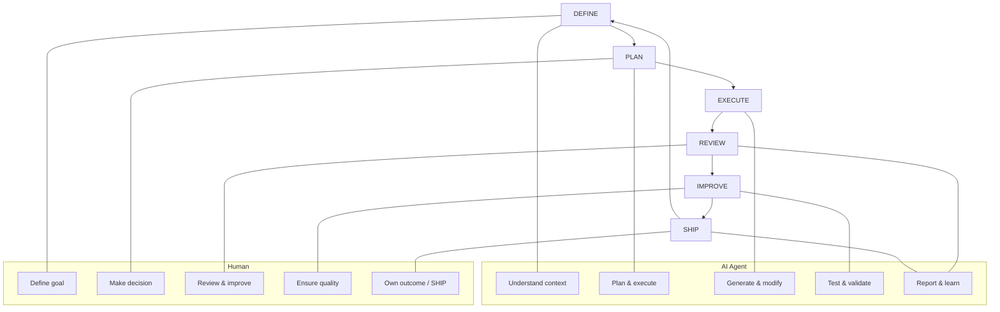
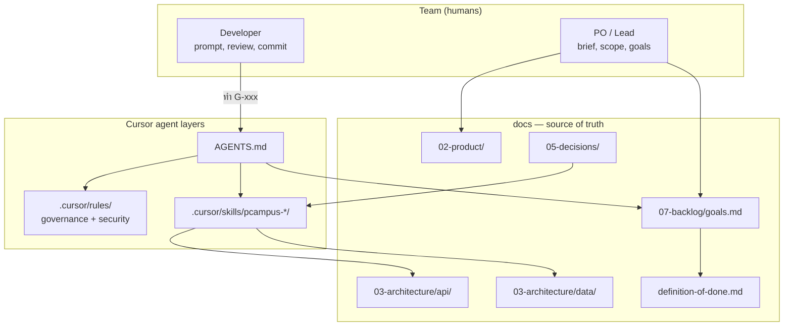
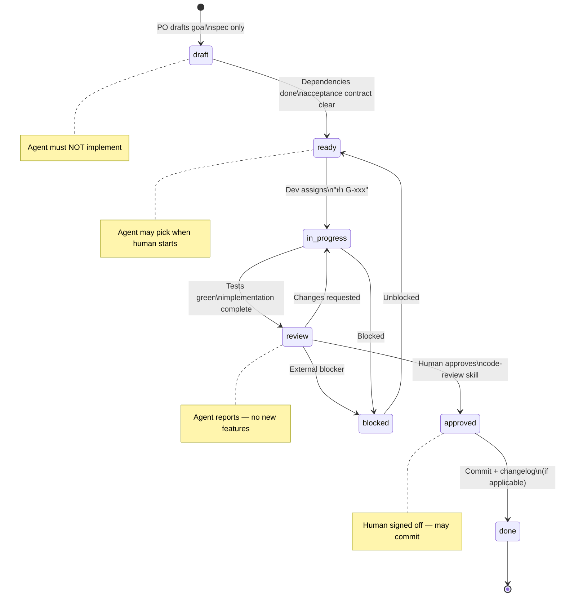
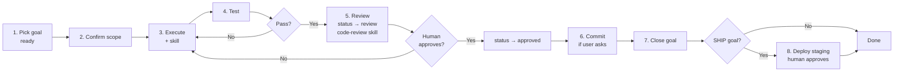
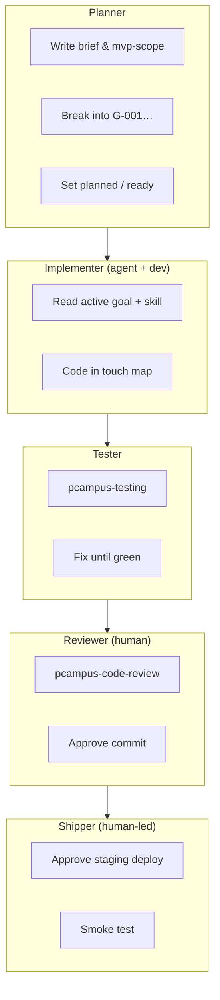
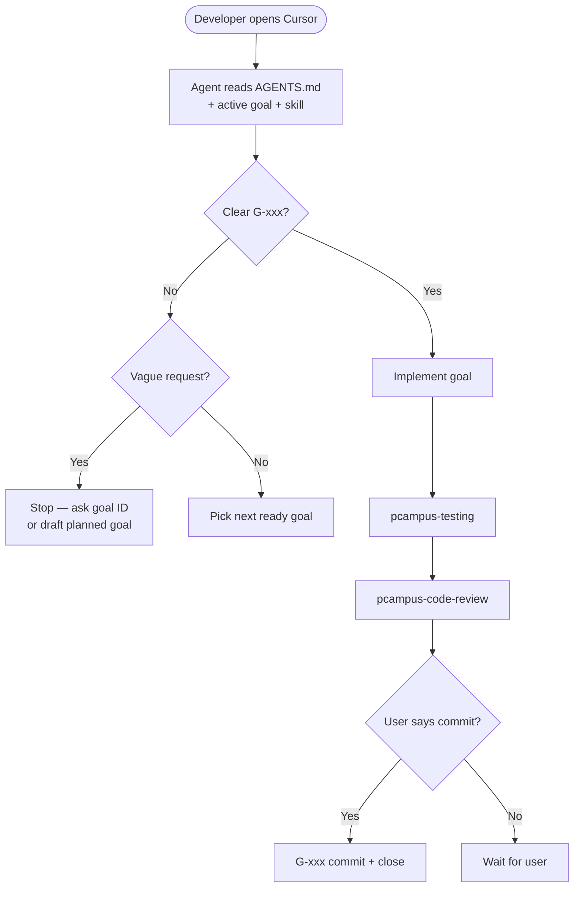

# Team workflow — goal-driven development with AI agents

> **For humans.** AI agents: read [AGENTS.md](../../AGENTS.md) and [dev-loop.md](dev-loop.md).

This document explains how **Pcampus Studio** runs every project with Cursor agents — goals, rules, and versioned skills so Human + Agent collaboration stays scoped and reviewable.

Framework reference: [design-spec.md](../03-architecture/design-spec.md) · Infographic: [human-agent-cycle.png](../assets/human-agent-cycle.png)

---

## 1. Human + Agent cycle (6 phases)



| Phase | Human | Agent | Docs / skills |
|-------|-------|-------|---------------|
| DEFINE | Scope, priority | Read context | `project-brief`, `mvp-scope`, `goals.md` |
| PLAN | ADR, goal breakdown | Confirm scope | `pcampus-goal-workflow` |
| EXECUTE | — | Code in touch map | `pcampus-rest-api`, `pcampus-db-migration`, … |
| REVIEW | Approve / request changes | Report diff | `pcampus-code-review` |
| IMPROVE | Quality bar | Run tests | `pcampus-testing`, DoD |
| SHIP | Approve deploy | Prepare staging | `pcampus-deploy-staging` |

---

## 2. Big picture — where everything lives



| Layer | Who writes it | Who consumes it |
|-------|---------------|-----------------|
| `docs/02-product/` | PO / lead | Everyone + agent |
| `docs/03-architecture/api/`, `data/` | Dev + agent (per goal) | Everyone + agent |
| `docs/07-backlog/goals.md` | Planner | Agent picks **one** `ready` goal |
| `docs/05-decisions/` | Tech lead | Agent when linked in goal |
| `.cursor/rules/` | Pcampus Agent OS + stack | Agent always |
| `.cursor/skills/pcampus-*/` | Pcampus Agent OS | Agent when task matches |
| `AGENTS.md` | Bootstrap customize | Agent first read |

---

## 3. Goal lifecycle



---

## 4. One dev round (one goal)



**Rule:** One goal ≈ one commit ≈ one reviewable PR slice.

---

## 5. Roles in one session



Same person can wear all hats — the **documents and skills** keep roles explicit.

---

## 6. How to talk to the agent



### Prompt cheat sheet

| ✅ Good | ❌ Avoid |
|---------|----------|
| ทำ G-005 ตาม goals.md | ทำแอปให้เสร็จ |
| review diff G-005 | merge ให้เลย |
| approve G-005 | agent ปิด done เอง |
| deploy staging ตาม G-010 | deploy prod เอง |
| ต่อ goal ready ถัดไป | refactor ทั้ง repo |
| commit G-005 | commit ทุกอย่างที่แก้ |

### Bootstrap prompts (new project)

**Planner (no code yet):**

```
อ่าน AGENTS.md และ docs/00-index.md
ช่วยร่าง project-brief.md, mvp-scope.md และ goals G-001… (planned)
ยังไม่เขียน production code
```

**First implementation:**

```
อ่าน AGENTS.md แล้วทำ G-001 ตาม goals.md
ใช้ pcampus-testing + pcampus-code-review ก่อนปิด goal
อย่า commit จนกว่าฉันจะสั่ง
```

---

## 7. Standard skills (always available)

See [skills-library.md](../04-agents/skills-library.md) for versions and changelog.

| Skill | Trigger |
|-------|---------|
| `pcampus-goal-workflow` | Any G-xxx work |
| `pcampus-rest-api` | API endpoints |
| `pcampus-testing` | Tests |
| `pcampus-code-review` | Before done / PR |
| `pcampus-deploy-staging` | SHIP / staging |
| `pcampus-incident-response` | Incidents |
| `pcampus-db-migration` | Schema changes |

## GitHub hard guards

See [github-governance.md](../06-workflows/github-governance.md) — PR template, governance CI, protected branches.

Add `{project}-*` skills only for conventions unique to one product.

---

## Related

- [dev-loop.md](dev-loop.md)
- [definition-of-done.md](definition-of-done.md)
- [../07-backlog/changelog.md](../07-backlog/changelog.md) — audit trail
- [github-governance.md](github-governance.md)
- [../04-agents/dev-roles.md](../04-agents/dev-roles.md)
- [../04-agents/skills-library.md](../04-agents/skills-library.md)
- [../07-backlog/goals.md](../07-backlog/goals.md)
- [../../AGENTS.md](../../AGENTS.md)
